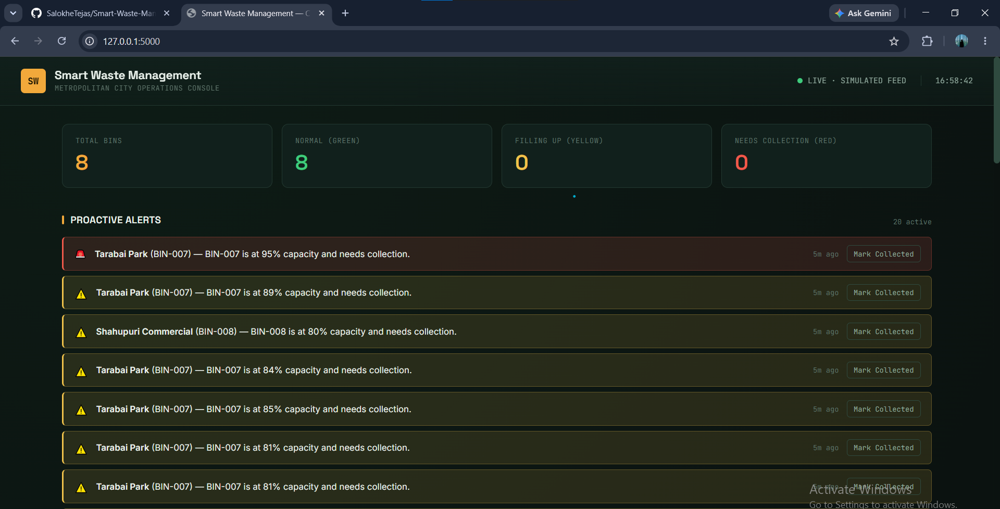
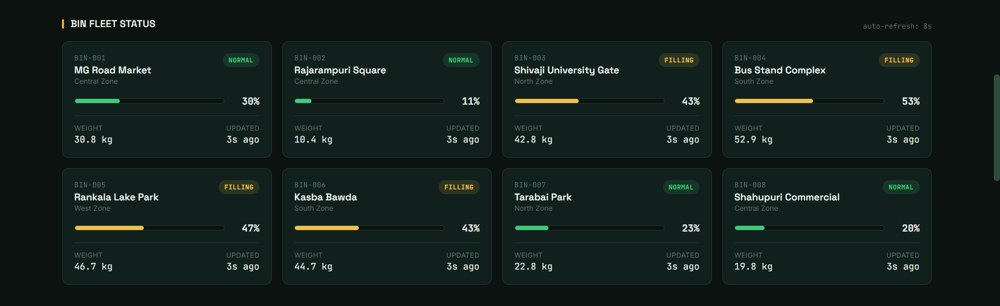
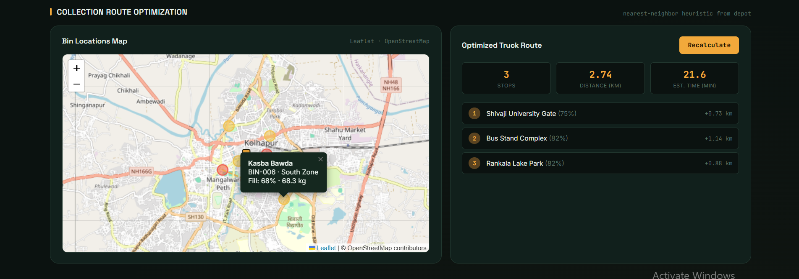
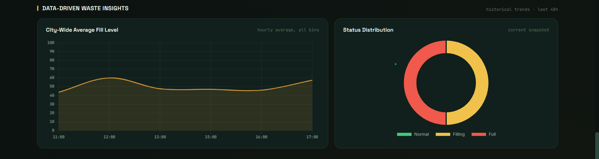
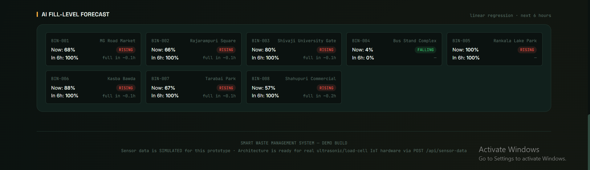

<div align="center">

# 🗑️ Smart Waste Management System
### For Metropolitan Cities

**A full-stack IoT-simulated intelligent waste management platform**  
Real-time bin monitoring · Route optimization · AI-powered fill-level forecasting · Proactive alerts

[](https://python.org)
[](https://flask.palletsprojects.com)
[](https://sqlite.org)
[](https://chartjs.org)
[](https://leafletjs.com)
[](LICENSE)

[📺 Demo Video](https://drive.google.com/file/d/12bXxTbJqQN6nafrLRDC1nBGQq2jL_fF7/view?usp=sharing) · [🐛 Report Bug](https://github.com/SalokheTejas/Smart-Waste-Management-System-For-Metropolitan-Cities/issues) · [💡 Request Feature](https://github.com/SalokheTejas/Smart-Waste-Management-System-For-Metropolitan-Cities/issues)

</div>

---

## 📋 Table of Contents

- [Overview](#-overview)
- [Screenshots](#-screenshots)
- [System Architecture](#-system-architecture)
- [Features](#-features)
- [Project Structure](#-project-structure)
- [How It Works — Module by Module](#-how-it-works--module-by-module)
- [Tech Stack](#-tech-stack)
- [Getting Started](#-getting-started)
- [API Reference](#-api-reference)
- [Hardware Integration Readiness](#-hardware-integration-readiness)
- [Database Schema](#-database-schema)
- [Configuration](#-configuration)
- [Phase Documentation](#-phase-documentation)
- [Contributing](#-contributing)

---

## 🌐 Overview

The **Smart Waste Management System** is a production-ready prototype dashboard that simulates how a metropolitan city can intelligently manage its waste infrastructure using IoT sensors, real-time analytics, and AI-powered prediction.

Eight smart bins placed across **Kolhapur City** continuously report fill-level and weight data. The system raises proactive alerts, optimizes truck collection routes using Haversine-based nearest-neighbor pathfinding, and forecasts when each bin will be full using linear regression — all in a dark-themed, auto-refreshing web dashboard.

> **Designed for Real Hardware:** The simulator can be replaced by actual ESP32/Arduino devices POSTing to the same REST endpoint with zero changes to the rest of the codebase. The architecture is deliberately hardware-agnostic.

---

## 📸 Screenshots

### 🔔 Proactive Alerts Panel
> Bins exceeding 80% capacity trigger live alert banners with a one-click "Mark Collected" action.



---

### 📦 Bin Fleet Status
> All 8 city bins displayed as color-coded cards (Green → Yellow → Red) with live fill %, weight, zone, and last-reading timestamp.



---

### 🗺️ Collection Route Optimization
> Nearest-neighbor optimized route shown on a Leaflet.js map with polylines, stop list, total distance (km), and estimated collection time.



---

### 📊 Data-Driven Waste Insights
> City-wide trend chart (48h average fill level) and a status breakdown donut chart, both auto-refreshed every 8 seconds.



---

### 🔮 AI Fill-Level Forecast
> Per-bin linear regression forecast: predicted fill level 6 hours ahead, trend direction, hours-until-full estimate, and confidence rating.



---

## 🏗️ System Architecture

```
┌─────────────────────────────────────────────────────────────┐
│                   BROWSER (Dashboard)                       │
│   HTML · CSS (dark theme) · vanilla JS · Chart.js · Leaflet │
│              Auto-refreshes every 8 seconds                  │
└───────────────────────┬─────────────────────────────────────┘
                        │  HTTP REST (JSON)
                        ▼
┌─────────────────────────────────────────────────────────────┐
│                  Flask Backend  (app.py)                     │
│                                                             │
│   ┌────────────┐  ┌──────────────┐  ┌───────────────────┐  │
│   │  /api/bins │  │ /api/alerts  │  │ /api/route/       │  │
│   │  /history  │  │  /resolve    │  │   optimize        │  │
│   │  /trends   │  └──────────────┘  └───────────────────┘  │
│   └────────────┘                                            │
│   ┌──────────────────────────────────────────────────────┐  │
│   │  Background Thread → sensors/simulator.py (every 8s) │  │
│   └──────────────────────────────────────────────────────┘  │
└──────────────┬──────────────┬──────────────────────────────┘
               │              │
               ▼              ▼
┌──────────────────┐  ┌────────────────────────────────────┐
│ database/        │  │ optimization/                       │
│ db_setup.py      │  │   route_planner.py (Haversine NN)  │
│ (SQLite)         │  │   predictor.py  (Linear Regression) │
└──────────────────┘  └────────────────────────────────────┘
```

**Data flow:**
1. Background thread calls `simulator.generate_reading()` every 8 seconds per bin
2. Reading is saved via `db_setup.insert_reading()` → auto-generates alerts if fill ≥ 80%
3. Browser polls `/api/bins` (and other endpoints) every 8 seconds
4. Flask returns JSON; `dashboard.js` updates cards, map markers, and charts in-place

---

## ✨ Features

### 🚛 Core Scenarios

| Scenario | Description |
|---|---|
| **Optimized Collection Routes** | Nearest-neighbor Haversine route across all bins ≥ 70% full, rendered on a live Leaflet.js map with polylines, stop-by-stop table, total distance, and estimated time |
| **Proactive Maintenance Alerts** | Auto-detects bins ≥ 80% (warning) and ≥ 90% (critical); live alert banner; one-click "Mark Collected" resets the bin and resolves the alert |
| **Data-Driven Waste Insights** | 7 days of seeded historical data + live city-wide 48h trend chart + status donut chart showing Green / Yellow / Red distribution |

### 🤖 AI & Analytics

| Feature | Implementation |
|---|---|
| **Fill-Level Forecasting** | OLS linear regression on per-bin recent readings; predicts fill % 6 hours ahead |
| **Hours Until Full** | Derived from regression slope: `(100 - intercept) / slope` |
| **Trend Classification** | `rising` / `falling` / `stable` based on regression slope threshold (±0.02) |
| **Confidence Rating** | `high` (≥5 data points) · `medium` (≥3) · `low` (<3) |
| **Cycle-Aware Regression** | Detects "collection events" (sharp fill drops) and restricts regression to the current filling cycle for accuracy |

### 📡 Live Dashboard

- 8-second auto-refresh across all panels (bins, alerts, map, charts)
- Per-bin modal popup with full history chart + AI prediction
- Color-coded bin markers on Leaflet.js map (🟢 green / 🟡 yellow / 🔴 red)
- Live clock, pulse indicator, and summary strip (total / green / yellow / red counts)
- Dark "City Operations Console" UI theme (Space Grotesk + Inter + JetBrains Mono fonts)

---

## 📁 Project Structure

```
Smart-Waste-Management-System-For-Metropolitan-Cities/
│
├── app.py                          # Flask entry point: all routes, API endpoints, background simulator thread
├── requirements.txt                # Python dependencies (Flask 3.0.3)
│
├── database/
│   ├── __init__.py
│   ├── db_setup.py                 # ALL SQLite operations: schema creation, seeding, CRUD functions
│   └── waste_management.db         # Auto-created on first run (7 days of seed data)
│
├── sensors/
│   ├── __init__.py
│   └── simulator.py                # IoT sensor simulation: trending fill + sawtooth collection events
│
├── optimization/
│   ├── __init__.py
│   ├── route_planner.py            # Nearest-neighbor heuristic + Haversine distance route optimizer
│   └── predictor.py                # OLS linear regression fill-level forecaster
│
├── templates/
│   └── index.html                  # Single-page dashboard (Jinja2 template, ~200 lines)
│
├── static/
│   ├── css/style.css               # Dark "City Operations Console" theme (~714 lines)
│   └── js/dashboard.js             # Client-side logic: API polling, card rendering, charts (~507 lines)
│
├── Outputs_Screen_Shots/           # Dashboard screenshot images
├── Project_Demonstration/
│   └── Project_Demonstration_Video_Link.txt    # Demo video + GitHub link
│
└── Phase 1–5 PDFs/                 # Full project documentation (planning → final report)
```

---

## 🔍 How It Works — Module by Module

### `app.py` — Flask Application Core

The main entry point. Responsibilities:
- Registers all REST API routes (9 endpoints total)
- Launches a **daemon background thread** (`simulate_sensors_forever`) that calls the sensor simulator every `SIMULATION_INTERVAL_SECONDS` (default: 8s) for each bin
- Initializes the database on startup (`db_setup.init_db()`)
- Serves the single-page dashboard via `render_template("index.html")`

```python
SIMULATION_INTERVAL_SECONDS = 8   # Change this to control update frequency
```

---

### `database/db_setup.py` — Data Layer

The **only file that touches SQL**. This single-responsibility design means swapping SQLite for PostgreSQL/TimescaleDB in production only requires editing this one file.

**Tables created:**

| Table | Purpose |
|---|---|
| `bins` | Static bin metadata: `bin_id`, `name`, `lat`, `lng`, `zone`, `capacity_kg` |
| `bin_readings` | Time-series sensor data: `fill_level`, `weight_kg`, `status`, `timestamp` |
| `alerts` | Auto-generated alert log: `severity` (warning/critical), `resolved` flag |

**Key functions:**

| Function | What it does |
|---|---|
| `init_db()` | Creates tables + seeds 8 bins + generates 7 days of history (idempotent) |
| `insert_reading(bin_id, fill_level, weight_kg)` | Inserts a reading; auto-creates alert if fill ≥ 80% |
| `get_all_bins_with_latest_reading()` | JOIN query powering dashboard cards + map |
| `get_history_for_bin(bin_id, limit)` | Per-bin history for charts and AI prediction |
| `get_city_wide_trend(hours)` | Hourly-bucketed average fill across all bins |
| `get_active_alerts(limit)` | Unresolved alerts for the alert rail |
| `resolve_alerts_for_bin(bin_id)` | Marks alerts resolved + simulates bin emptying |

**Status mapping:** `fill_level < 40%` → `green` · `40–70%` → `yellow` · `≥70%` → `red`

**Bin locations (Kolhapur City):**

| Bin ID | Location | Zone |
|---|---|---|
| BIN-001 | MG Road Market | Central |
| BIN-002 | Rajarampuri Square | Central |
| BIN-003 | Shivaji University Gate | North |
| BIN-004 | Bus Stand Complex | South |
| BIN-005 | Rankala Lake Park | West |
| BIN-006 | Kasba Bawda | South |
| BIN-007 | Tarabai Park | North |
| BIN-008 | Shahupuri Commercial | Central |

---

### `sensors/simulator.py` — IoT Sensor Simulation

Simulates an ultrasonic fill-level sensor (HC-SR04 equivalent) and a load-cell weight sensor.

**`generate_reading(previous_fill_level, capacity_kg=80)`**
- If `previous_fill_level` is given, applies a random delta (`-1.5` to `+6.0`) to trend upward gradually
- 15% chance of simulating a "collection event" (bin emptied to 0–10%) when fill > 75%
- Weight is derived as `(fill% / 100) × capacity_kg + noise(±2.5 kg)`
- Produces realistic **sawtooth** data rather than random noise

> **To use real hardware:** stop calling this function in the background thread and let real devices POST to `/api/sensor-data` instead. Nothing else changes.

---

### `optimization/route_planner.py` — Route Optimization

**Algorithm:** Nearest-Neighbor greedy heuristic  
**Distance:** Haversine formula (great-circle distance, accurate for real-world lat/lng)  
**Depot:** Lat 16.6995, Lng 74.2356 (simulated truck garage)

**Steps:**
1. Filter bins to only those with `fill_level ≥ COLLECTION_THRESHOLD` (default 70%)
2. Starting from the depot, repeatedly jump to the **closest unvisited bin**
3. Track cumulative distance and per-stop distance
4. Estimate time: `(total_km / 25 km/h × 60) + (stops × 5 min/stop)`

**Returns:**
```json
{
  "route": [{ "bin_id": "BIN-001", "name": "MG Road Market", "lat": 16.705, "lng": 74.2433,
              "fill_level": 87.3, "distance_from_prev_km": 0.42 }, "..."],
  "total_distance_km": 3.78,
  "bins_needing_collection": 5,
  "estimated_time_minutes": 34.1,
  "depot": { "name": "Waste Collection Depot", "lat": 16.6995, "lng": 74.2356 }
}
```

---

### `optimization/predictor.py` — AI Fill-Level Forecasting

**Algorithm:** Ordinary Least Squares (OLS) linear regression — implemented in pure Python with no external ML libraries.

**Why OLS?** Bin fill-level within a single collection cycle is approximately linear (waste accumulates at a fairly steady rate). OLS provides a useful, explainable forecast without requiring scikit-learn or TensorFlow, while the interface (`predict_fill_level(history, hours_ahead)`) can be swapped for Prophet, LSTM, or any other model later.

**Cycle detection:** Walks backwards through history to find the last "collection event" (a `>15%` drop in fill level going backwards), then restricts regression to readings from the **current filling cycle** only — this avoids fitting across multiple sawtooth cycles.

**`predict_fill_level(history, hours_ahead=6)` returns:**
```json
{
  "current_level": 62.4,
  "predicted_level": 91.0,
  "trend": "rising",
  "hours_until_full": 4.7,
  "confidence": "high"
}
```

---

### `static/js/dashboard.js` — Frontend Logic

507 lines of vanilla JavaScript that:
- Polls all API endpoints every 8 seconds using `setInterval` + `fetch`
- Dynamically renders bin cards, alert banners, and route stop tables into DOM
- Initializes and updates **Leaflet.js** map: depot marker, color-coded bin markers, route polyline
- Initializes and updates two **Chart.js** instances: city-wide 48h trend line chart + status donut chart
- Opens per-bin modals with a detail history chart and AI prediction panel
- Handles the "Mark Collected" button (POSTs to `/api/alerts/resolve/<bin_id>`, then refreshes)

---

## 🛠️ Tech Stack

| Category | Technology | Purpose |
|---|---|---|
| **Backend** | Python 3.8+, Flask 3.0.3 | REST API server, background thread, routing |
| **Database** | SQLite (via `sqlite3` stdlib) | Time-series sensor data, bins, alerts |
| **Frontend** | HTML5, CSS3, Vanilla JavaScript | Single-page dashboard, no framework overhead |
| **Map** | Leaflet.js + OpenStreetMap tiles | Live bin map with markers and route polyline (no API key needed) |
| **Charts** | Chart.js 4.4.1 | Trend line chart, status donut chart, per-bin history chart |
| **Fonts** | Space Grotesk, Inter, JetBrains Mono | Display, body, and data label typography |
| **Simulation** | Python `random` module | Realistic sensor data simulation |
| **ML/AI** | Pure Python OLS | Linear regression without external dependencies |

---

## 🚀 Getting Started

### Prerequisites

- Python **3.8 or higher**
- `pip` (Python package manager)
- A modern web browser

### Installation

**1. Clone the repository**
```bash
git clone https://github.com/SalokheTejas/Smart-Waste-Management-System-For-Metropolitan-Cities.git
cd Smart-Waste-Management-System-For-Metropolitan-Cities
```

**2. Create a virtual environment** *(recommended)*
```bash
# macOS / Linux
python3 -m venv venv
source venv/bin/activate

# Windows
python -m venv venv
venv\Scripts\activate
```

**3. Install dependencies**
```bash
pip install -r requirements.txt
```

> `requirements.txt` contains only `Flask==3.0.3`. All other features use Python's standard library.

**4. Run the application**
```bash
python app.py
```

You should see:
```
============================================================
 Smart Waste Management System - Starting Server
 Dashboard: http://127.0.0.1:5000
============================================================
```

The SQLite database (`database/waste_management.db`) and 7 days of historical seed data are created **automatically on first run**.

**5. Open the dashboard**

Navigate to **[http://127.0.0.1:5000](http://127.0.0.1:5000)** in your browser.

---

### Using the Dashboard

| Action | How |
|---|---|
| View live bin status | Bin cards auto-refresh every 8 seconds |
| See a bin's history + AI forecast | Click any bin card or map marker |
| Simulate a collection event | Click **Mark Collected** on any alert |
| View optimized route | Scroll to the Collection Route Optimization panel |
| See trend charts | Scroll to Data-Driven Waste Insights |

### Resetting Data

```bash
# Delete the database and restart — it will reseed automatically
rm database/waste_management.db
python app.py
```

---

## 📡 API Reference

All endpoints return `Content-Type: application/json`.

### Bins

| Method | Endpoint | Description |
|---|---|---|
| `GET` | `/api/bins` | All bins with latest sensor reading |
| `POST` | `/api/sensor-data` | Submit a new sensor reading (real hardware endpoint) |
| `GET` | `/api/bins/<bin_id>/history?limit=50` | Historical readings for one bin |
| `GET` | `/api/trends/city?hours=48` | City-wide average fill trend, hourly buckets |

**POST `/api/sensor-data` body:**
```json
{
  "bin_id": "BIN-001",
  "fill_level": 88.5,
  "weight_kg": 65.2
}
```

**Test with curl:**
```bash
curl -X POST http://127.0.0.1:5000/api/sensor-data \
  -H "Content-Type: application/json" \
  -d '{"bin_id": "BIN-001", "fill_level": 88.5, "weight_kg": 65.2}'
```

### Alerts

| Method | Endpoint | Description |
|---|---|---|
| `GET` | `/api/alerts` | All active (unresolved) alerts |
| `POST` | `/api/alerts/resolve/<bin_id>` | Mark a bin's alerts resolved + reset fill level |

### Route Optimization

| Method | Endpoint | Description |
|---|---|---|
| `GET` | `/api/route/optimize?threshold=70` | Nearest-neighbor optimized collection route |

### AI Prediction

| Method | Endpoint | Description |
|---|---|---|
| `GET` | `/api/bins/<bin_id>/predict?hours=6` | Fill forecast for one bin |
| `GET` | `/api/predict/all` | Fill forecast for every bin (used by Insights panel) |

---

## 🔌 Hardware Integration Readiness

This system is architected so that replacing the simulated sensors with real IoT hardware requires **minimal code changes**:

### What Real Hardware Would Look Like

```
[Physical Bin]
  └─ HC-SR04 Ultrasonic Sensor  →  fill level %
  └─ HX711 + Load Cell          →  weight in kg
  └─ ESP32 / Arduino            →  microcontroller
       │
       └─ POST /api/sensor-data every N seconds
            { "bin_id": "BIN-001", "fill_level": 73.2, "weight_kg": 41.5 }
```

### Migration Steps

| Step | Change Required |
|---|---|
| **1. Stop simulator** | Comment out `sim_thread.start()` in `app.py` (or keep it for bins without hardware) |
| **2. Plug in hardware** | Real devices POST to `/api/sensor-data` — this endpoint already exists and is fully functional |
| **3. Scale database** | Edit only `database/db_setup.py` to point at PostgreSQL/TimescaleDB — all function signatures remain identical |
| **4. Upgrade ML** | Replace `predictor.predict_fill_level()` body with Prophet/LSTM/scikit-learn — the interface stays the same |

> The sensor simulator logic lives in exactly **one function** (`sensors/simulator.py → generate_reading()`). Every other module is already production-ready.

---

## 🗄️ Database Schema

```sql
-- Static bin registry
CREATE TABLE bins (
    bin_id      TEXT PRIMARY KEY,
    name        TEXT NOT NULL,
    lat         REAL NOT NULL,
    lng         REAL NOT NULL,
    zone        TEXT NOT NULL,
    capacity_kg REAL DEFAULT 100.0
);

-- Time-series sensor readings
CREATE TABLE bin_readings (
    reading_id  INTEGER PRIMARY KEY AUTOINCREMENT,
    bin_id      TEXT NOT NULL,
    fill_level  REAL NOT NULL,      -- percentage 0–100
    weight_kg   REAL NOT NULL,      -- kilograms
    status      TEXT NOT NULL,      -- 'green' | 'yellow' | 'red'
    timestamp   TEXT NOT NULL,      -- ISO-8601 format
    FOREIGN KEY (bin_id) REFERENCES bins (bin_id)
);

-- Alert log
CREATE TABLE alerts (
    alert_id   INTEGER PRIMARY KEY AUTOINCREMENT,
    bin_id     TEXT NOT NULL,
    message    TEXT NOT NULL,
    severity   TEXT NOT NULL,       -- 'warning' (≥80%) | 'critical' (≥90%)
    timestamp  TEXT NOT NULL,
    resolved   INTEGER DEFAULT 0,   -- 0 = active, 1 = resolved
    FOREIGN KEY (bin_id) REFERENCES bins (bin_id)
);
```

---

## ⚙️ Configuration

All tunable constants live at the top of their respective files for easy adjustment:

| Constant | File | Default | Description |
|---|---|---|---|
| `SIMULATION_INTERVAL_SECONDS` | `app.py` | `8` | How often the simulator generates new readings |
| `COLLECTION_THRESHOLD` | `route_planner.py` | `70` | Minimum fill % to include a bin in the route |
| `DEPOT` | `route_planner.py` | `{lat: 16.6995, lng: 74.2356}` | Truck garage starting point |
| Alert warning threshold | `db_setup.py` | `80` | Fill % that triggers a warning alert |
| Alert critical threshold | `db_setup.py` | `90` | Fill % that triggers a critical alert |
| Prediction horizon | `predictor.py` | `6 hours` | How far ahead to forecast fill level |
| History seed days | `db_setup.py` | `7 days` | How much historical data to seed on first run |

---

## 📄 Phase Documentation

The project was developed across 5 structured phases:

| Phase | Document | Contents |
|---|---|---|
| **Phase 1** | `Phase 1 Project Initialization and Planning Phase/` | Problem statement, system design, scope, timeline |
| **Phase 2** | `Phase 2 Data Collection and Preprocessing Phase/` | Sensor simulation strategy, data schema, preprocessing logic |
| **Phase 3** | `Phase 3 Model Development/` | Route optimization algorithm, prediction model design |
| **Phase 4** | `Phase 4 Model Optimization and Tuning Phase/` | Hyperparameter tuning, cycle-aware regression, threshold selection |
| **Phase 5** | `Phase 5 Final Report/` | Complete project report + submission document |

---

## 🤝 Contributing

Contributions are welcome! Here are some ideas for extending the system:

- **Real hardware integration** — Wire up an ESP32 + HC-SR04 + HX711 to POST real sensor data
- **MQTT support** — Add a Paho MQTT subscriber bridge for low-bandwidth sensor networks
- **PostgreSQL / TimescaleDB** — Swap SQLite in `db_setup.py` for a time-series database
- **Advanced ML** — Replace OLS predictor with Facebook Prophet or an LSTM for better accuracy
- **Authentication** — Add Flask-Login for multi-user city operator access
- **Google OR-Tools** — Upgrade nearest-neighbor routing to a full TSP solver
- **Mobile PWA** — Convert the dashboard to a Progressive Web App for field workers

**To contribute:**
```bash
git fork https://github.com/SalokheTejas/Smart-Waste-Management-System-For-Metropolitan-Cities
git checkout -b feature/your-feature-name
# make your changes
git commit -m "feat: describe your change"
git push origin feature/your-feature-name
# open a Pull Request
```

---

## 👤 Author

**Tejas Salokhe**
- GitHub: [@SalokheTejas](https://github.com/SalokheTejas)
- Project: [Smart Waste Management System](https://github.com/SalokheTejas/Smart-Waste-Management-System-For-Metropolitan-Cities)

---

## 📺 Demo

Watch the full project demonstration:  
🎬 [Google Drive Demo Video](https://drive.google.com/file/d/12bXxTbJqQN6nafrLRDC1nBGQq2jL_fF7/view?usp=sharing)

---

<div align="center">

Made with ❤️ for smarter, cleaner cities

*"A clean city is a smart city."*

</div>
